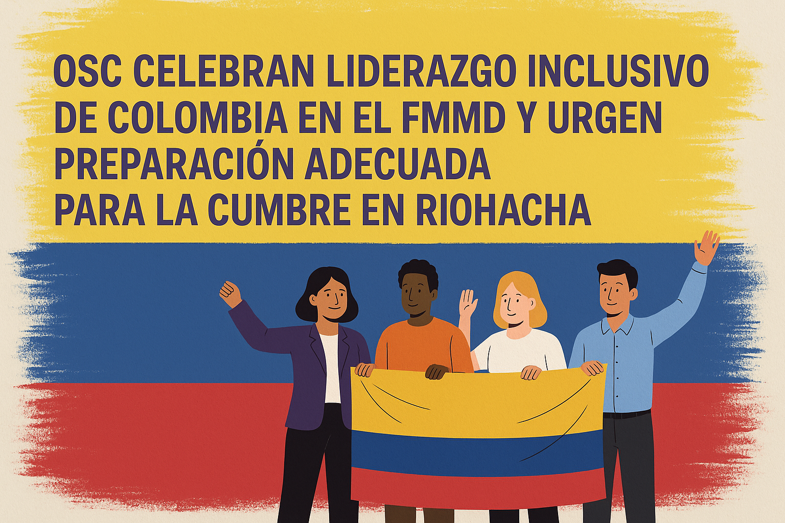

S.E. Presidente Gustavo Petro 

Ministra de Relaciones Exteriores, S.E. Laura Sarabia 

Honorables Miembros de la Segunda Comisión del Senado 

Honorables Miembros de la Comisión Segunda Constitucional 

Distinguidos Representantes del Gobierno de Colombia 

Presidencia Colombiana del Foro Mundial sobre Migración y Desarrollo (FMMD)

Colombia, mayo de 2025

Estimado Presidente Petro, Estimada Canciller Sarabia, Honorables Senadores y Representantes, estimados/as colegas:

Nosotras y nosotros, las organizaciones de la sociedad civil (OSC) firmantes de todo el territorio colombiano y de la diáspora colombiana en el mundo — muchas de las cuales llevamos años trabajando en primera línea en temas de migración, derechos humanos, desarrollo y justicia social — escribimos con entusiasmo y urgencia, como representantes de las OSC colombianas que participamos en el [Foro Mundial sobre Migración y Desarrollo (FMMD)](https://www.gfmd.org/) a través de su Mecanismo de Sociedad Civil (MSC) y del Comité Local. Recibimos con profunda gratitud y determinación la Presidencia colombiana de la 15ª Cumbre del FMMD, programada para celebrarse en Riohacha en septiembre de 2025.

Nos comunicamos con ustedes en un momento clave. El liderazgo de Colombia en el FMMD ya está siendo reconocido mundialmente como una de las presidencias más abiertas e inclusivas hasta la fecha. Como sociedad civil colombiana, nos hemos sentido vistas, escuchadas e invitadas a contribuir de manera significativa en este proceso. Esta apertura refleja lo mejor de la tradición democrática y humanista de Colombia y el espíritu de su gobierno. Creemos que este momento representa una oportunidad histórica, no sólo para el posicionamiento global del país y la Presidencia pro témpore de la [CELAC](https://celacinternational.org/), sino para el futuro de la gobernanza de la movilidad humana y la dignidad de las personas migrantes en todo el mundo.

:::{.callout-important}
El liderazgo de Colombia en el FMMD ya está siendo reconocido mundialmente como una de las presidencias más abiertas e inclusivas hasta la fecha. Como sociedad civil colombiana, nos hemos sentido vistas, escuchadas e invitadas a contribuir de manera significativa en este proceso.
:::

La Cumbre del FMMD no es simplemente otro evento o conferencia. Es el espacio de diálogo multilateral más amplio y abierto del mundo sobre migración y desarrollo, y el único que reúne en condiciones de igualdad a gobiernos, sociedad civil, gobiernos regionales y locales, sector privado, juventudes y organizaciones internacionales. A pesar de no ser vinculante, el FMMD es un espacio crucial en donde se construyen voluntades políticas, se perfilan prioridades globales, se forjan alianzas y donde la sociedad civil puede alzar la voz colectivamente y en sus propios términos.

:::{.callout-note}
La Cumbre del FMMD es el espacio de diálogo multilateral más amplio y abierto del mundo sobre migración y desarrollo, y el único que reúne en condiciones de igualdad a gobiernos, sociedad civil, gobiernos regionales y locales, sector privado, juventudes y organizaciones internacionales. 
:::

La Presidencia colombiana nos brinda una rara oportunidad para proyectar una visión latinoamericana, basada en los derechos humanos y con enfoque de sociedad en su conjunto, en un momento en que la criminalización de los y las personas migrantes y la xenofobia ganan terreno. Nos enorgullece que Colombia se esté posicionando como un referente global — y exhortamos al gobierno a aprovechar esta oportunidad con valentía y orgullo —.

En este contexto, celebramos la poderosa y simbólica decisión de realizar la Cumbre en Riohacha, La Guajira, una región que encarna la migración, la resiliencia y la diversidad. El cambio de sede envía un mensaje importante: las voces de las comunidades fronterizas son esenciales, y la dignidad, inclusión y transformación deben comenzar desde los márgenes hacia el centro. Muchas de nuestras organizaciones ya trabajan directamente en La Guajira y vemos de primera mano el gran impacto que este gesto puede tener, siempre que vaya acompañada de los recursos y la coordinación que la Cumbre requiere.

:::{.callout-important}
Las voces de las comunidades fronterizas son esenciales, y la dignidad, inclusión y transformación deben comenzar desde los márgenes hacia el centro
:::

Una Cumbre del FMMD exitosa en Riohacha tiene el potencial de resaltar el liderazgo de Colombia en un momento de transición continental y global. Los ojos del mundo estarán puestos en nosotros, puestos, por un lado, en el compromiso de Colombia con el diálogo y con la solidaridad regional, por el otro, en nuestra capacidad de llevar a cabo un evento logística y políticamente sólido e inclusivo. Precisamente porque creemos en la ambición y el poder simbólico de esta Cumbre, planteamos, con respeto pero con firmeza, las consideraciones prácticas que deben atenderse ahora.

La realidad es que Riohacha representa tanto una oportunidad como un desafío. Debemos ser conscientes de lo que se necesita para el adecuado desarrollo de este evento: infraestructura suficiente para albergar hasta 1200 delegados; alojamientos que reflejen los estándares y expectativas de conferencias internacionales de este calibre, donde atienden delegaciones de todo el mundo, con diferentes requerimientos y necesidades; rutas de transporte confiables, incluyendo coordinación oportuna con aerolíneas, particularmente desde y hacia Bogotá en las 48 horas antes y después del evento. Como mínimo, estos elementos son esenciales para permitir que el contenido del FMMD se desarrolle sin distracciones ni interrupciones.

También instamos al gobierno a comunicar de forma clara las orientaciones logísticas, incluyendo los requisitos de salud pública. Dado que La Guajira es una zona endémica de fiebre amarilla, es fundamental contar con información clara sobre vacunas, fumigación certificada, prevención contra mosquitos y atención médica en el lugar — idealmente con personal que hable inglés — como parte de la planificación anticipada. Igualmente, una información temprana y transparente sobre la disponibilidad hotelera, transporte hacia la sede, y protocolos de salud permitirá que gobiernos, organizaciones internacionales y sociedad civil (así como otros mecanismos y juventudes) se preparen adecuadamente.

:::{.callout-warning}
Una cumbre exitosa plantea desafíos en materia de:

+ Infraestructura
+ Alojamiento y transporte
+ Atención en salud
+ Seguridad
:::

De igual manera, es fundamental que existan protocolos de seguridad sólidos antes, durante y después de la Cumbre. Nuestros colegas del Mecanismo de Sociedad Civil para el FMMD han señalado que la seguridad es una preocupación importante para varios Estados Miembros, y es necesario garantizar que exista la percepción — y la realidad — de que Riohacha es un lugar seguro para recibir a la comunidad internacional.

Al mismo tiempo, expresamos con cautela nuestras reservas frente a las propuestas recientes de realizar una Cumbre en formato híbrido. Aunque valoramos y agradecemos los esfuerzos por ampliar el acceso, muchas organizaciones de la sociedad civil y Estados miembros temen que, si no se implementa correctamente, este formato pueda debilitar el entorno de participación, confianza, seguridad y equidad que caracteriza al FMMD.

Un modelo híbrido podría conducir involuntariamente a un sistema de participación en dos niveles, donde las personas delegadas presentes disfruten del acceso directo a los diálogos e interacciones, mientras que las personas que participan virtualmente queden relegadas a observar desde la distancia, separadas por pantallas y “manos levantadas” en línea. Además, existe un riesgo real de que algunos Estados y actores clave interpreten el formato híbrido como una señal de que no se requiere una participación plena, lo cual podría traducirse en delegaciones de menor nivel, o en algunos casos, en la decisión de no asistir a la Cumbre.

Si el modelo híbrido ha de formar parte de la reconfiguración de la Cumbre en Riohacha, debe estar adecuadamente financiado y planificado con transparencia: con límites claros en el tamaño de las delegaciones, número definido de personas participantes en línea por mecanismo y juventudes, conectividad garantizada en el lugar, interpretación funcional, herramientas de interacción efectivas, y personal capacitado para garantizar la sincronización entre los formatos presencial y virtual. También debe garantizarse la seguridad del espacio digital, para prevenir interrupciones y preservar el espíritu de Chatham House que sustenta las discusiones del Foro, especialmente las mesas redondas. Además para destacar la importancia del Foro, ambos para Colombia y la comunidad internacional, necesitamos contribuciones virtuales en directo de los ministerios. Este compromiso, especialmente un discurso en vivo, ya sea virtual o en persona, por el Presidente, encarnará el nivel de significado que puede llevar a los gobiernos mundiales.

:::{.callout-warning}
Es necesaria la cautela a la hora de determinar formatos híbridos:

+ Presencial + En línea
+ Más de una ciudad sede
:::

Asimismo, queremos expresar nuestra preocupación frente a la posibilidad de realizar eventos oficiales del FMMD en dos ciudades distintas durante la Cumbre. Esta división geográfica encarece la participación de muchas delegaciones, al igual que genera una dinámica en dos niveles: una más visible y centralizada, y otra periférica. Esto se traduciría en desigualdad en el acceso a los espacios de diálogo y toma de decisiones. Esta disposición exigiría que los Estados miembros y las partes interesadas dividieran sus delegaciones, lo que complicaría el alojamiento y la logística general de participación. Igualmente, esto llevaría a que muchas delegaciones de gobiernos concentren su apoyo en los miembros de alto nivel, priorizando inevitablemente una sede sobre la otra. Para preservar la coherencia, la legitimidad y el impacto de la Cumbre, consideramos esencial que todas las actividades sustantivas se desarrollen en una sola ciudad.

Reconocemos la complejidad de estos esfuerzos, pero también tenemos la certeza de que Colombia tiene la capacidad, el liderazgo, la visión política y la imaginación para estar a la altura de este momento — siempre que invierta en una acción interministerial coordinada y aproveche el conocimiento de las autoridades locales y actores de sociedad civil que ya trabajan en la región —.

Como sociedad civil colombiana, estamos listos para contribuir a este proceso, no sólo con nuestra crítica constructiva, sino con nuestro compromiso, nuestras redes, experiencia y apoyo, somos un recurso disponible para el equipo organizador y estamos a su disposición. Esta es una oportunidad única para que Colombia lidere, no sólo con discurso, sino con ejemplo.

La soledad de América Latina, nace no sólo de la violencia, la exclusión y el peso de ser vistos con ojos ajenos y medidos con estándares ajenos. Esta soledad, como reflexiona García Márquez, no es sólo consecuencia de fuerzas externas, sino del haber sido negado el derecho a forjar nuestro propio destino. Para los millones de personas migrantes y desplazadas en nuestra región, esta soledad es una realidad cotidiana: a menudo invisibles, inauditos y privados del poder de decidir sobre sus propias vidas. La Cumbre del FMMD es una oportunidad para sentir compañía en la inagotable misión de trabajar por una migración digna. En Riohacha, Colombia puede ser la voz de un continente que ya no quiere seguir condenado a cien años de soledad, y que está listo para cambiar el rumbo de la historia poniendo el centro a la vida y la dignidad.

:::{.callout-important}
La Cumbre del FMMD es una oportunidad para sentir compañía en la inagotable misión de trabajar por una migración digna. En Riohacha, Colombia puede ser la voz de un continente que ya no quiere seguir condenado a cien años de soledad, y que está listo para cambiar el rumbo de la historia poniendo el centro a la vida y la dignidad.
:::

Asegurémonos de que, cuando el mundo llegue a Riohacha este próximo septiembre, encuentre algo más que una cumbre: encuentre un símbolo poderoso. Una nación dispuesta a liderar con visión, solidaridad y cooperación. Frente al resto del mundo, es cada vez más evidente que, al igual que los Buendía, la comunidad internacional está atrapada en un ciclo de lecciones no aprendidas. Este es el momento de Colombia para brillar como una luz de esperanza, resiliencia y liderazgo transformador, en la Cumbre del FMMD más importante hasta la fecha, una cumbre de claridad y de cambio.

Con solidaridad,

Comité Local del MSC del FMMD

[Organizaciones firmantes](https://bit.ly/firmantes_SC)

[¿Quieres firmar esta carta?](https://bit.ly/Carta_SC_Firma)