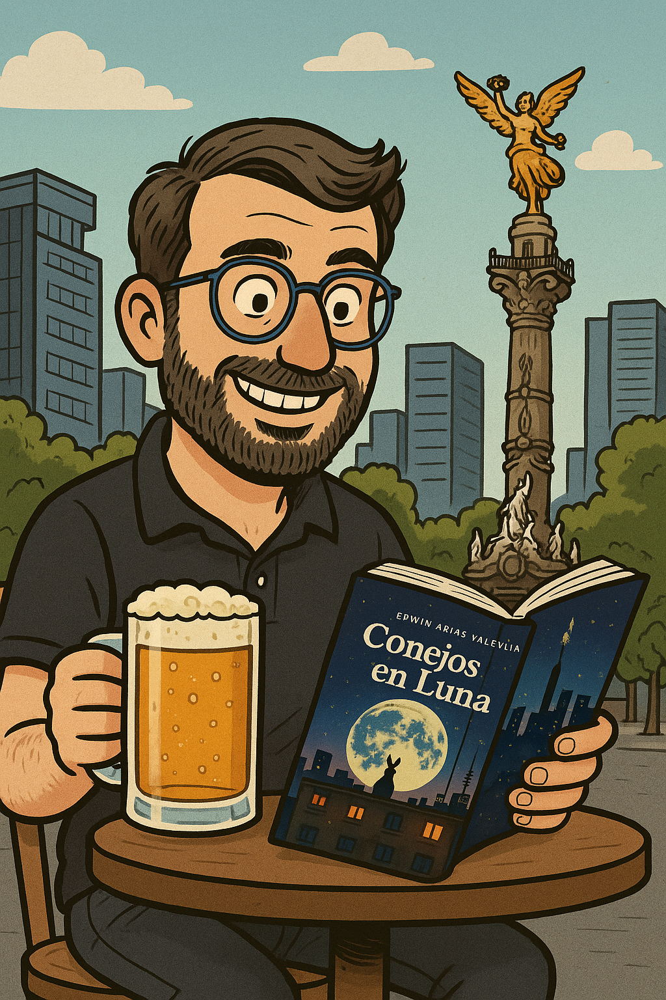

[Conejos en La Luna](https://www.amazon.com.mx/Conejos-Spanish-Edwin-Arias-Valencia/dp/B0F6S1RMJ9) es la nueva novela de mi amigo Edwin Arias [@conejos_luna]. Trata de la vida de un grupo de jóvenes en Medellín que buscan sentido y alegría a través de la música, la filosofía, el arte y las drogas. Es una novela sugestiva, con notas muy reflexivas, por lo que considero que podría estar destinada a un público adulto (aunque se clasifica para adolescentes). Por mi parte, me evocó recuerdos bonitos de mi vida juvenil en una Medellín que se reconoce, pero no es la que está retratada en la novela. No obstante, hubiera preferido un final con más esperanza y un desarrollo mayor de algunos personajes.

Jack Malagradecido y JuanitaCorazonLibre se conocen y enamoran rápidamente, como es la vida en la juventud. Su relación está llena de conversaciones interesantes y profundas sobre ética y estética, en medio de un ambiente que invita a la fiesta y a la sensualidad. Sus noches transcurren entre alcohol, drogas y sexo en medio de la vida nocturna de una Medellín que es fiesta y música, pero son reflexivas y profundas. 

¿El goce y la alegría son resistencia ante un sistema que nos trata como máquinas? ¿La tecnificación de la vida es neutral? ¿Podemos adaptarla y ponerla al servicio de nuestros intereses? Este tipo de conversaciones, así como otras sobre cine de culto y arte, se perfilan como pinceladas entre la cotidianidad de Jack, Juanita y sus amigas y amigos.

En ellas se nota el perfil de Edwin como politólogo y gestor cultural, que imprime en sus personajes algunas preocupaciones suyas sobre la vida, aunque no ahonda en ellas, sino que las deja apenas como una invitación a la reflexión.

En estas conversaciones también, me sentí nostálgico de la vida juvenil que pasé en una Medellín que se perfilaba, pero que no era como la que viven los personajes. La mía también fue una Medellín musical, pero vibraba al ritmo de rock, salsa, hip-hop y música de protesta. También era una Medellín de fiesta, pero no en bares bonitos con cocteles elegantes, sino en espacios abiertos llenos de rebeldía: El Periodista, Bantú y el Carlos E., con cerveza o licores baratos de mala calidad. En esos espacios, también, la conversación era sobre cómo resistir al sistema, buscar sentido a la vida y perseguir y atesorar la alegría.

Tal vez por esos temas y por los recuerdos que evocaron, el libro me pareció destinado a un público más adulto que aquel para el que está clasificado. ¿Es un libro para jóvenes? ¿O para adultos nostálgicos de la juventud que vemos en los jóvenes de hoy la esperanza y la rebeldía que hacen falta para construir un futuro más promisorio?

En la novela, todos los personajes tienen una angustia existencial sobre cuál es su papel en el mundo y cuál es el futuro que está destinado para ellos. Esta angustia recorre todas las páginas del libro. En una escena inicial, están Juanita con su amiga Mariana y parece que el parque al que van a fumarse un porro es un refugio en el que todo cobra el sentido que se pierde afuera. En las escenas finales, aparece Gomezzz con sueños de un mundo de lujos y placeres que apenas puede fantasear, que jamás alcanzará y que es completamente distinto a aquel en el que vive.

Creo que esa angustia existencial es muy propia de la juventud y en ella también me sentí muy empático e identificado con los personajes. Sin embargo, hubiera preferido que el final del libro quedara más abierto y que esas angustias no se materializaran. Me dejó un mal sabor de boca cuando al final parece que no hay futuro y que la angustia cubre con su manto a los personajes.

Sí es verdad que el futuro es muy incierto, las oportunidades escasas y el mundo a veces parece dirigirse hacia lugares que habíamos creído vencidos en el pasado... Pero también lo es que la juventud es potencial transformador y que la vida usualmente termina por imponerse. Después de la angustia y la búsqueda, muchas veces viene un futuro que no nos imaginábamos cuando pasábamos esa etapa, un futuro bueno.

Por otra parte, también me hubiera gustado encontrar un mayor desarrollo de los personajes a lo largo de la novela. Únicamente sentí a Jack y a Juanita como personajes completos, y a María como una mujer bien esbozada. Pero no sentí lo mismo de Mariana, Gomezzz, la chica de la cámara, la diseñadora y otros personajes que aparecían en el paisaje para caer rápidamente en el olvido... Tal vez eso hubiera querido reflejarse en la novela como un rasgo de la juventud: personajes que aparecen intensamente, aportan algo a la vida y luego se esfuman, sin apenas dejar tiempo para darse cuenta del evento... Pero no creo que esta característica halla sido buscada en la novela, sino más bien que aparecían muchos personajes prometedores sin un papel claro en el desarrollo del texto.

En resumen, recomiendo la novela de Edwin para tener una lectura agradable y ligera de una tarde. Me parece muy evocativa de una época bonita de la vida, llena de vida y experiencias intensas, lo que en mi caso provocó mucha nostalgia. La novela es una invitación a reflexionar más allá del texto: sobre el sentido de la vida, de la alegría de vivir y de cómo apropiarnos de las ciudades y las experiencias.
