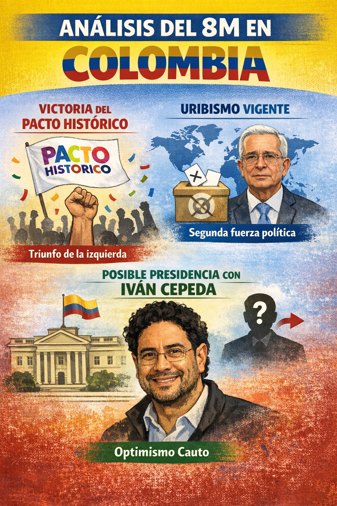

El Diálogo Ciudadano para evaluar la jornada electoral del 8 de marzo contó con la participación de varias personas de la comunidad colombiana en México. En mi evaluación sobre la jornada, planteé como elementos relevantes:

+ El Pacto Histórico ganó la contienda
+ Pero el uribismo no es un actor derrotado o marginal, sino que sigue siendo la segunda fuerza del país
+ De hecho, a nivel internacional ellos ganaron la curul internacional de la Cámara y en México obtuvieron dos votos, por cada uno ganado por el Pacto Histórico.
+ Es muy probable que ganemos las elecciones presidenciales con Iván Cepeda, pero no es seguro que eso pase. Se necesita un trabajo serio desde la izquierda para lograrlo, entonces podemos tener un optimismo cauto sobre el futuro.

<style>
.slide-deck {
    border: 3px solid #dee2e6;
    width: 100%;
    height: 475px;
}
</style>

<div>
```{=html}
<iframe class="slide-deck" src="../../presentaciones/20260315_analisis-elecciones-8m/index.html"></iframe>
```
</div>

A continuación, se muestra el video completo del diálogo desarrollado. Mi participación se encuentra entre el minuto 48:30 y el 01:00:00.

<iframe src="https://www.facebook.com/plugins/video.php?height=314&href=https%3A%2F%2Fwww.facebook.com%2FMeMuevoPorColombia%2Fvideos%2F1563911904720267%2F&show_text=false&width=560&t=0" width="560" height="314" style="border:none;overflow:hidden" scrolling="no" frameborder="0" allowfullscreen="true" allow="autoplay; clipboard-write; encrypted-media; picture-in-picture; web-share" allowFullScreen="true"></iframe>

