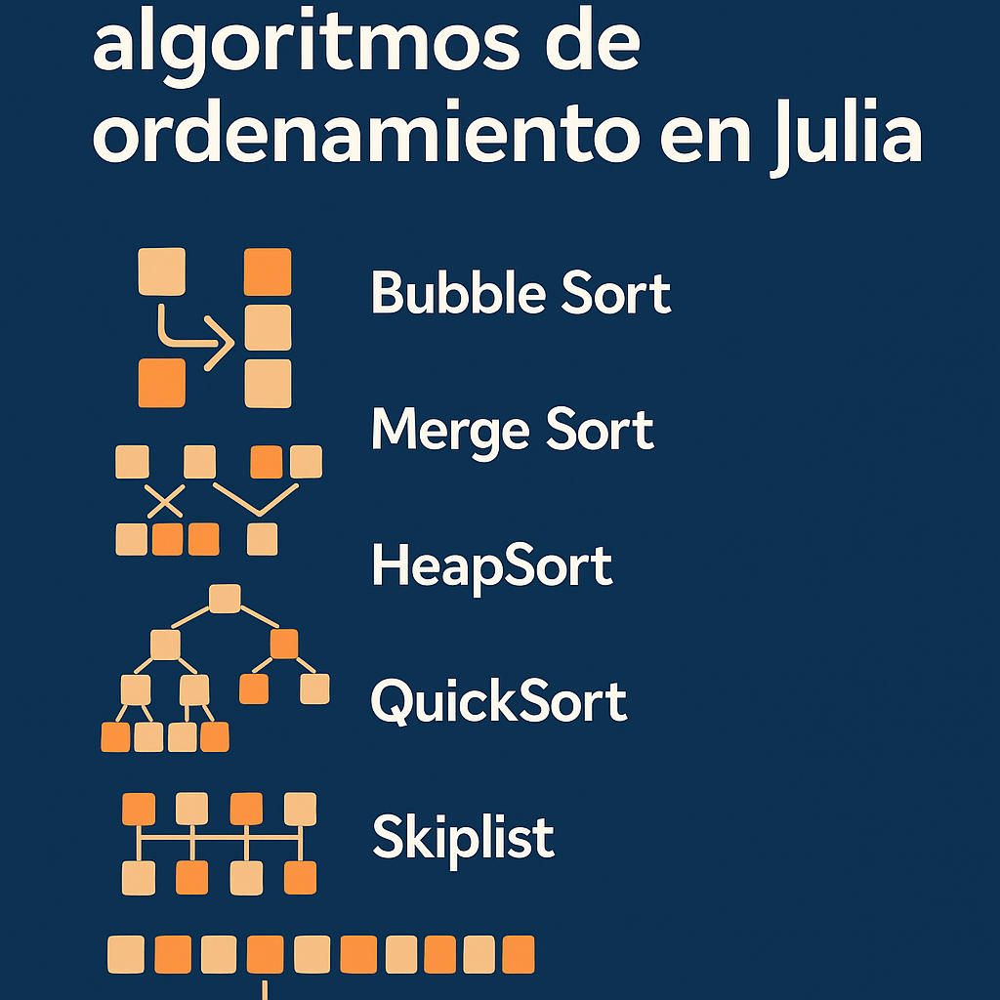

```{julia}
#| label: software

using Dates, DataFrames, JSON, Random
rng = Xoshiro(20250304)
```

# Introducción

En este documento se implementan diversos algoritmos de ordenamiento en `Julia` y se compara su rendimiento promedio para ordenar vectores con diferentes niveles de desorden, tanto en tiempo de ejecución como en número de operaciones.

# Algoritmos de ordanamiento

El problema de ordenamiento recibe una secuencia de $n$ números $(a_1, \dots, a_n)$ y entrega una permutación $(a_1^\prime, \dots, a_n^\prime)$ tal que $a_1^\prime \leq \dots \leq a_n^\prime$. En esta sección se analizan e implementan en `Julia` 4 algoritmos de ordenamiento y una estructura de datos que se utiliza para ordenar los elementos de un vector de entrada.

## Buble sort

"*Bublesort*" es un algoritmo de ordenamiento popular, pero ineficiente, que intercambia repetidamente entradas adyacentes de un arreglo que se encuentran desordenadas [@cormen, p. 24]. "*Bublesort*" se describe en el @alg-burbuja y se implementó en `Julia` mediante la función `burbuja!()`.

```pseudocode
#| label: alg-burbuja
#| html-line-number: true

\begin{algorithm}
\caption{BUBLESORT($A, n)$}
\begin{algorithmic}[1]
    \For{$i = 1$ a $n - 1$}
        \For{$j = n$ descendiendo hasta $i + 1$}
            \If{$A[j] < A[j - 1]$}
                \State Intercambiar $A[j]$ con $A[j - 1]$
            \EndIf
        \EndFor
    \EndFor
\end{algorithmic}
\end{algorithm}
```

Al respecto, se observa que en la línea 4 del @alg-burbuja se realizan todas las operaciones que implican mover los registros del arreglo. Por lo tanto, se adicionó un contador opcional a la función `burbuja!()` que contabiliza el número de operaciones que se realizan en dicha iteración.

Asimismo, se observa que el costo del algoritmo está dominado por la segunda iteración, por lo que el costo de "*Buble Sort*" es $O(n^2)$.

```{julia}
#| label: funcion_burbuja

function burbuja!(a::Vector, c::Union{Nothing, Int64} = nothing)
    n = a.size[1]
    for i in 1:(n-1)
        for j in n:-1:(i+1)
            if a[j] < a[j - 1]
                a[j], a[j - 1] = a[j - 1], a[j]
                if c isa Int64
                    c += 1
                end
            end
        end
    end
    return c
end
```

```{julia}
#| label: verificar_burbuja
#| include: false

# Funciona bien para arreglar.
x = rand(rng, 0:1000, 10); c = burbuja!(x)
println( x, c )
x = rand(rng, 0:1000, 10); c = burbuja!(x)
println( x, c )
```

## Merge sort

El algoritmo "*merge sort*" (unifica-ordena) ordena el subarrego `A[p:r]`, comenzando desde el arreglo completo `A[1:n]` y haciendo recursiones hasta llegar al caso base, que es un subarreglo con un único elemento (que, por definición, está ordenado). Cuando las recursiones se unen, se unifican dos subarreglos que ya se encuentran ordenados (`A[p:q]` y `A[q + 1, r]`), para obtener el arreglo `A[p:r]` ordenado, hasta llegar nuevamente al arreglo completo [@cormen, pp. 34-35]. Esta segunda parte del procedimiento se implementa mediante el @alg-unir, disponible en @cormen[p. 36], que fue implementado en `Julia` mediante la función `une!()`.

```pseudocode
#| label: alg-unir
#| html-line-number: true

\begin{algorithm}
\caption{UNIR($A, p, q, r)$}
\begin{algorithmic}[1]
    \State $n_L = q - p + 1$
    \Comment{Tamaño de los subarreglos (ordenados)}
    \State $n_R = r - q$
    \State Sean $L[0:n_L - 1]$ y $R[0:n_R - 1]$ nuevos arreglos
    
    \For{$i=0$ a $n_L -1$} 
        \Comment{Copiar $A[p:q]$ en $L[0:n_L - 1]$}
        \State $L[i] = A[p + i]$
    \EndFor
    \For{$j = 0$ a $n_R - 1$}
        \State $R[j] = A[q + j + 1]$
    \EndFor
    
    \Comment{Índices de los mínimos restantes en $L$ y $R$, 
             y de la posición de $A$ para llenar}
    \State $i = 0$
    \State $j = 0$
    \State $k = 0$

    \While{$i < n_L$ y $j < n_R$}
    \Comment{Poner en la posición de $A$ al más pequeño de $L$ y $R$ cada
             vez, hasta que quede vacío alguno de los dos}
        \If{$L[i] < R[j]$}
            \State $A[k] = L[i]$
            \State $i = i + 1$
        \Else
            \State $A[k] = R[j]$
            \State $j = j + 1$
        \EndIf
        \State $k = k + 1$
    \EndWhile
    \Comment{Después de vaciar uno completamente, copiar el resto del que
             quede en lo que falte de $A$}
    \While{$i < n_L$}
        \State $A[k] = L[i]$
        \State $i = i + 1$
        \State $k = k + 1$
    \EndWhile
    \While{$j < n_R$}
        \State $A[k] = R[j]$
        \State $j = j + 1$
        \State $k = k + 1$
    \EndWhile
\end{algorithmic}
\end{algorithm}
```

Al respecto, se observa que en la línea 13 del @alg-unir se realizan la mayoría de las operaciones no triviales que implican mover registros entre vectores. Lo anterior, pues aunque las líneas 4 a 9 y 23 a 32 también lo hacen, dichos movimientos pueden implementarse como movimientos de bloques continuos de memoria y no requieren la identificación de cuál entrada es menor que otra. Por lo tanto, se adicionó un contador opcional a la función `une!()` que contabiliza el número de operaciones que se realizan en la iteración de la línea 13 del @alg-unir.

```{julia}
#| label: funcion_une

function une!(
    a::Vector, 
    p::Int64, q::Int64, r::Int64, 
    c::Union{Nothing, Int64} = nothing)
    # a. Genera subarreglos izquierdo y derecho, ordenados (supuesto)
    nl = q - p + 1
    nr = r - q
    l, r = a[p:q], a[q + 1:r]

    # b. Pone el más pequeño de los dos en el arreglo
    i, j, k = 1, 1, p
    while i <= nl && j <= nr
        if c isa Int64
            c += 1
        end
        if l[i] <= r[j]
            a[k] = l[i]
            i += 1
        else
            a[k] = r[j]
            j += 1
        end
        k += 1
    end

    # c. Pone lo que quede del subarreglo que no se haya vaciado
    while i <= nl
        a[k] = l[i]
        i += 1
        k += 1
    end
    while j <= nr
        a[k] = r[j]
        j += 1
        k += 1
    end
    return c
end
```

```{julia}
#| label: verificar_une
#| include: false

# Funciona correctamente :)
a = [numero for numero in 1:2:10]
append!(a, [numero for numero in 2:2:12])
c = une!(a, 1, 5, 10)
println( a, c )

a = [numero for numero in 1:2:10]
append!(a, [numero for numero in 2:2:12])
c = une!(a, 1, 5, 10, 0)
println( a, c )
```

Por su parte, la primera parte del procedimiento, que realiza la recursión sobre $A$ desde el arreglo completo hasta el caso base, se implementa mediante el @alg-ordenar_unir disponible en@cormen[p. 39],^[Observe que este algoritmo hace un llamado al @alg-unir, en la línea 7 del pseudocódigo.] que fue implementado en `Julia` mediante la función `ordena_une()`.

```pseudocode
#| label: alg-ordenar_unir
#| html-line-number: true

\begin{algorithm}
\caption{ORDENAR-UNIR($A, p, r$)}
\begin{algorithmic}[1]
    \If{$p \geq r$}
        \Return $A$
    \EndIf
    \State $q = \lfloor \frac{p + r}{2} \rfloor$
    \State ORDENAR-UNIR($A, p, q$)
    \State ORDENAR-UNIR($A, q + 1, r)$
    \State UNIR($A, p, q, r)$
\end{algorithmic}
\end{algorithm}
```

En la implementación en `Julia` se adicionó un contador opcional a la función `ordena_une!()` que se actualiza en cada llamada a la función `une!()`; es decir, que contabiliza el número de veces que se itera la línea 13 del @alg-unir para todo el arreglo. Lo anterior, pues las líneas 1 a 6 del @alg-ordenar_unir únicamente consideran el costo de la división del arreglo en las diferentes subramas generadas por el algoritmo.

Asimismo, se señala que el tiempo de ejecución de este algoritmo es $\Theta(n \log_2 n)$, tanto en el peor caso como el tiempo promedio [@cormen, p. 160].

```{julia}
#| label: funcion_ordena_une

function ordena_une!(
    a::Vector, c::Union{Nothing, Int64} = nothing, 
    p::Union{Nothing, Int64} = nothing, 
    r::Union{Nothing, Int64} = nothing)
    if p isa Nothing
        p = 1
    end
    if r isa Nothing
        r = length(a)
    end
    if p >= r
        return a
    end
    q = floor(Int64, (p + r) / 2)
    ordena_une!(a, c, p, q)
    ordena_une!(a, c, q + 1::Int64, r)
    c = une!(a, p, q, r, c)
    return c
end
```

```{julia}
#| label: verificar_ordena_une
#| include: false

# Funciona bien para arreglar.
x = rand(rng, 0:1000, 10); c = ordena_une!(x)
println( x, c )

x = rand(rng, 0:1000, 10); c = ordena_une!(x, 0)
println( x, c )
```

## Heapsort

Una pila binaria (*binary heap*) es una estructura de datos en un arreglo que puede verse como un árbol binario (*binary tree*) que se encuentra completamente lleno en todos los niveles excepto, probablemente, en el inferior (que se encuentra lleno desde la izquierda hasta un determinado punto). Un arreglo $A[1:n]$ que representa a una pila es un objeto con el atributo $A.tamano\_pila$ que señala cuántos elementos de la pila están almacenados en el arreglo $A$. En la pila, el elemento $A[1]$ es la raíz del árbol y cada elemento con índice $i = 1, \dots, n$ tiene un padre (con índice $\lfloor i/2 \rfloor$), un hijo a la izquierda (con índice $2i$) y un hijo a la derecha (con índice $2i + 1$). Existen dos clases de pilas: máximas y mínimas; las primeras tienen la propiedad de que el padre de cualquier elemento es mayor o igual que este ($A[\lfloor i/2 \rfloor] \geq A[i], \forall i$) [@cormen, sección 6.1]. 

Para implementar esta estructura de datos se generó una estructura mutable en `Julia` denominada `Pila`, que contiene los atributos `tamano` y `arreglo`; esta estructura puede construirse a partir de un arreglo, que se convierte en el segundo atributo, mientras que el primero es el tamaño del propio arreglo que construye la estructura. A continuación, se muestra la estructura y su constructor.

```{julia}
#| label: estructura_pila
#| code-fold: show

mutable struct Pila
    tamano::Int64
    arreglo::Vector
    function Pila(a::Vector)
        new(a.size[1], a)
    end
end
```

El @alg-apilamax aplica la propiedad de las pilas máximas a una pila binaria, a partir del índice $i$. Es decir, asume que los árboles que se forman a partir de los hijos del índice $i$ de la pila son pilas máximas, pero que $A[i]$ puede violar la propiedad señalada, por lo que este algoritmo le permite a dicho índice bajar en el árbol hasta la posición adecuada para recuperar la propiedad [@cormen, sección 6.2]. Este algoritmo fue implementado en `Julia` mediante la función `apilamax!()`.

```pseudocode
#| label: alg-apilamax
#| html-line-number: true

\begin{algorithm}
\caption{APILAR-MAXIMO($A, i$)}
\begin{algorithmic}[1]
    \State $l = 2i$
    \State $r = 2i + 1$
    \If{$l \leq A.tamano\_pila$ y $A[l] > A[i]$}
        \State $mayor = l$
    \Else
        \State $mayor = i$
    \EndIf

    \If{$r \leq A.tamano\_pila$ y $A[r] > A[mayor]$}
        \State $mayor = r$
    \EndIf

    \If{$mayor \neq i$}
        \State Intercambiar $A[i]$ con $A[mayor]$
        \State APILAR-MAXIMO($A, mayor$)
    \EndIf
\end{algorithmic}
\end{algorithm}
```

Al respecto, se observa que la operación costosa en el @alg-apilamax se encuentra en el intercambio del renglón 12. Por lo tanto, se adicionó un contador opcional a la función `apilamax!()`, que contabiliza el número de estas operaciones.

```{julia}
#| label: funcion_apilamax

function apilamax!(a::Pila, i::Int64, c::Union{Nothing, Int64} = nothing)
    l = 2 * i
    r = l + 1
    
    # Identificar si el mayor es otro índice
    m = (l <= a.tamano && a.arreglo[l] > a.arreglo[i]) ? l : i
    m = (r <= a.tamano && a.arreglo[r] > a.arreglo[m]) ? r : m
    if m != i
        a.arreglo[i], a.arreglo[m] = a.arreglo[m], a.arreglo[i]
        if c isa Int64
            c += 1
        end
        apilamax!(a, m, c)
    end
    return c
end
```

Por su parte, el @alg-contruye_pila_max convierte una pila en una pila binaria máxima al utilizar el @alg-apilamax en los primeros $\lfloor n/2 \rfloor$ elementos del arreglo. Este algoritmo se implementó en `Julia` mediante la función `construye_pila_max!()`, que tiene un argumento opcional para contabilizar el número de operaciones que se realizan en los diferentes llamados a la función `apilamax!()`. A diferencia del algoritmo, la función implementada no recibe como insumo a un arreglo, sino a una pila que, en todo caso, se construye a partir del arreglo mismo.

```pseudocode
#| label: alg-contruye_pila_max
#| html-line-number: true

\begin{algorithm}
\caption{CONTRUIR-PILA-MAXIMA($A, n)$}
\begin{algorithmic}[1]
    \State $A.tamano\_pila = n$
    \For{$i = \lfloor n/2 \rfloor$ descendiendo hasta 1}
        \State APILAR-MAXIMO($A, i$)
    \EndFor
\end{algorithmic}
\end{algorithm}
```

```{julia}
#| label: funcion_construye_pila_max

function construye_pila_max!(a::Pila, c::Union{Nothing, Int64} = nothing)
    for i in floor(Int64, a.tamano / 2):-1:1
        c = apilamax!(a, i, c)
    end
    return c
end
```

```{julia}
#| label: evalua_construye_pila_max
#| include: false

# Parece que funciona bien.
x = Pila([4, 1, 3, 2, 16, 9, 10, 14, 8, 7]); c = construye_pila_max!( x )
println( x, c )

x = Pila([4, 1, 3, 2, 16, 9, 10, 14, 8, 7]); c = construye_pila_max!( x, 0 )
println( x, c )
```

Una vez que se cuenta con la estructura de la pila binaria máxima, explicada previamente, el algoritmo de ordenamiento simplemente toma la raíz de la pila, que es el elemento máximo y lo pone en su lugar correcto al final del arreglo, elimina ese nodo de la pila, reestablece la propiedad de apilamiento máximo, toma el nuevo nodo y lo pone en su lugar correcto en el penúltimo lugar del arreglo y continúa ejecutando este procedimiento iterativamente hasta haber reacomodado todos los elementos. Este procedimiento se implementa mediante el @alg-heapsort disponible en @cormen[sección 6.4].

```pseudocode
#| label: alg-heapsort
#| html-line-number: true

\begin{algorithm}
\caption{HEAPSORT($A, n)$}
\begin{algorithmic}[1]
    \State CONSTRUIR-PILA-MAXIMA($A, n$)
    \For{$i = n$ descendiendo hasta 2}
        \State Intercambiar $A[1]$ con $A[i]$
        \State $A.tamano\_pila = A.tamano\_pila - 1$
        \State APILAR-MAXIMO($A, 1$)
    \EndFor
\end{algorithmic}
\end{algorithm}
```

Este algoritmo se implementó en `Julia` mediante la función `heapsort()`, que tiene un argumento opcional para contabilizar el número de operaciones que se realizan en la línea 3 del @alg-heapsort, así como en los diferentes llamados a la función `apilamax!()`.

De acuerdo con @cormen[p. 172] este algoritmo tiene un tiempo de ejecución de $O(n \log_2 n)$.

```{julia}
#| label: funcion_heapsort

function heapsort(a::Vector, c::Union{Nothing, Int64} = nothing)
    a = Pila(a)
    c = construye_pila_max!( a, c )
    for i in a.tamano:-1:2
        a.arreglo[1], a.arreglo[i] = a.arreglo[i], a.arreglo[1]
        a.tamano -= 1
        if c isa Int64
            c += 1
        end
        c = apilamax!(a, 1, c)
    end
    return c, a.arreglo
end
```

```{julia}
#| label: verifica_heapsort
#| include: false

# Funciona bien para arreglar.
println( heapsort(rand(rng, 0:1000, 10)) )
println( heapsort(rand(rng, 0:1000, 10), 0) )
```

## Quicksort

El algoritmo *quicksort* utiliza un procedimiento que particiona un subarreglo $A[p:r]$ en tres conjuntos determinados por el último elemento del arreglo original $A[r]$,^[Una versión aleatorizada del algoritmo primero intercambia el último elemento por uno elegido al azar, para obtener el rendimiento promedio [@cormen, p. 192].] este elemento se ubica en el conjunto pivote, antes de él se encuentran los elementos que son menores y después los que son mayores, asimismo el procedimiento entrega el índice del elemento pivote. Dicho procedimiento se encuentra disponible en el @alg-particion disponible en @cormen[p. 183-184].

```pseudocode
#| label: alg-particion
#| html-line-number: true

\begin{algorithm}
\caption{PARTICIÓN($A, p, r$)}
\begin{algorithmic}[1]
    \State $x = A[r]$ \Comment{El pivote es el último}
    \State $i = p - 1$
    \For{$j = p$ a $r - 1$}
        \If{$A[j] \leq x$} 
        \Comment{Si es menor, va a la izquierda y se actualiza la posición
                 del pivote}
            \State $i = i + 1$
            \State Intercambiar $A[i]$ con $A[j]$
        \EndIf
    \EndFor
    \State Intercambiar $A[i + 1]$ con $A[r]$
    \Comment{El pivote va en la mitad de lo identificado}
    \State \Return $i + 1$
\end{algorithmic}
\end{algorithm}
```

Este algoritmo se implementó en `Julia` mediante la función `particion!()`, que tiene un argumento opcional para contabilizar el número de veces que se itera el procedimiento en la línea 4 del @alg-particion y un argumento opcional para correr la versión aleatorizada.

```{julia}
#| label: particion

function particion!(
    a::Vector, p::Int64, r::Int64, 
    c::Union{Nothing, Int64} = nothing, 
    aleatorizado::Bool = false, rng = nothing)
    if aleatorizado
        if rng isa Nothing
            i = rand(p:r)
        else
            i = rand(rng, p:r)
        end
        a[r], a[i] = a[i], a[r]
    end
    x = a[r]
    i = p - 1
    for j in p:(r - 1)
        if a[j] <= x
            i += 1
            a[i], a[j] = a[j], a[i]
            if c isa Int64
                c += 1
            end
        end
    end
    a[i + 1], a[r] = a[r], a[i + 1]
    return i + 1, c
end
```

El @alg-quicksort particiona el vector que recibe como entrada y ordena recursivamente los lados menores y mayores del pivote que identifica, de forma que termina por obtener el vector odenado.^[Una versión aleatorizada de este algoritmo utiliza la versión aleatorizada del @alg-particion disponible en @cormen[p. 192].]

```pseudocode
#| label: alg-quicksort
#| html-line-number: true

\begin{algorithm}
\caption{QUICKSORT($A, p, r$)}
\begin{algorithmic}[1]
    \If{$p < r$}
        \State $q =\,$ PARTICIÓN($A, p, r$)
        \State QUICKSORT($A, p, q -1$)
        \State QUICKSORT($A, q + 1, r$)
    \EndIf
\end{algorithmic}
\end{algorithm}
```

Este algoritmo se implementó en `Julia` mediante la función `quicksort!()`, que tiene un argumento opcional para contabilizar el número de veces que se itera el procedimiento de la línea 4 del @alg-particion invocado recursivamente, así como un argumento opcional para ejecutar la versión aleatorizada.

De acuerdo con @cormen[pp. 193-194], el tiempo esperado de ejecución de "*quicksort*" es $\Theta(n \log_2 n)$, aunque puede llegar a requerir hasta $\Theta (n^2)$ en el peor caso.

```{julia}
#| label: funcion_quicksort

function quicksort!(
    a::Vector, 
    c::Union{Nothing, Int64} = nothing, 
    aleatorizado::Bool = false, rng = nothing,
    p::Union{Nothing, Int64} = nothing, 
    r::Union{Nothing, Int64} = nothing)

    if p isa Nothing
        p = 1
    end
    if r isa Nothing
        r = length(a)
    end
    if p < r
        q, c = particion!(a, p, r, c, aleatorizado, rng)
        quicksort!(a, c, aleatorizado, rng, p, q - 1)
        quicksort!(a, c, aleatorizado, rng, q + 1, r)
    end
    return c
end
```

```{julia}
#| label: verificar_quicksort
#| include: false

# Funciona bien para arreglar.
x = rand(0:1000, 10); c = quicksort!(x)
println( x, c )

x = rand(0:1000, 10); c = quicksort!(x, 0)
println( x, c )

x = rand(0:1000, 10); c = quicksort!(x, nothing, true, rng)
println( x, c )

x = rand(0:1000, 10); c = quicksort!(x, 0, true, rng)
println( x, c )
```

## Skiplist

@skiplists señalan que una "*skiplist*" consiste de dos estructuras de datos: la lista y los nodos que la conforman. La lista tiene dos atributos, que son nivel máximo y cabeceras, con punteros hacia los niveles $1, \dots, nivel\_maximo$.^[De acuerdo con @skiplists_pugh[p. 669], una nueva lista se inicializa con un nivel igual a 1 y con todos los apuntadores de la cabecera apuntando hacia `NIL`.] Por su parte, los nodos tienen dos atributos: valor y sucesores, que son un arreglo de punteros hacia otros nodos en diferentes niveles. Estas estructuras se implementaron en `Julia` con los tipos compuestos `Nodo` y `Lista_Salto`.^[La implementación en `Julia` sigue cercanamente a la explicación del usuario Sijun en mayo de 2022 para implementar una lista enlazada, disponible [aquí](https://discourse.julialang.org/t/how-do-i-code-a-simple-linked-list-using-datastructures-jl/80929/2).]

```{julia}
#| label: estructuras_skiplist
#| code-fold: show

# Nodos
mutable struct Nodo{T}
    valor::T
    sucesores::Vector{ Union{Nodo{T}, Nothing} }
end

Nodo{T}(valor::T, nivel::Int64) where {T} = Nodo{T}(
    valor, 
    Vector{ Union{Nodo{T}, Nothing} }(nothing, nivel) )
Nodo(valor::T, nivel::Int64) where {T} = Nodo{T}(valor::T, nivel::Int64)

# Listas
mutable struct Lista_Salto{T}
    nivel_maximo::Int64
    cabeceras::Vector{ Union{Nodo{T}, Nothing} }
end

Lista_Salto{T}() where {T} = Lista_Salto(
    1, 
    Vector{ Union{Nodo{T}, Nothing}}(nothing, 1) )
Lista_Salto() = Lista_Salto{Float64}()
```

De acuerdo con @skiplists_pugh[pp. 669-670], para insertar un nodo con valor $v$ simplemente se realiza una búsqueda y un empalme. Al respecto, @skiplists señalan que se debe:

+ Buscar el lugar en donde se acomodará el elemento
+ Elegir su nivel, que se elige de forma aleatoria aumentándolo en una unidad cada vez que un ensayo de Bernoulli con probabilidad $p$ arroje un éxito (por lo tanto, el número de niveles de cada nodo se distribuirá como una distribución de probabilidad geométrica).
+ Actualizar el puntero que debe dirigirse hacia el nuevo nodo.

Para elegir el lugar de ubicación del nuevo elemento, se parte de la cabecera de la lista en el nivel que se le asignó al nuevo nodo y se buscan dos nodos consecutivos $x, \, z$ tales que $x.valor < v \leq z.valor$. Si estos nodos existen, se actualizan los punteros para que $x$ apunte al nuevo nodo y este, a su vez, apunte a $z$. Este procedimiento se repite en todos los niveles inferiores de la lista. Al respecto, @skiplists plantean un algoritmo para implementar este procedimiento, cuya adaptación se muestra en el @alg-skiplist. Este algoritmo se implementó en `Julia` mediante la función `inserta_skiplist!()`, que contiene un argumento opcional para contabilizar el número de actualizaciones de punteros que realiza el algoritmo.

```pseudocode
#| label: alg-quicksort
#| html-line-number: true

\begin{algorithm}
\caption{INSERTAR-NODO-SKIPLIST($L, \theta$)}
\begin{algorithmic}[1]
    \State Lista con $n$ niveles, con cabeceras ($L.n, L.c[1,\dots,n]$
    \State Cabeceras apuntan a nodos $x$, con sucesores y valor ($x.s, x.\theta$)
    \State Insertar valor $\theta$ en el lugar adecuado
    
    \State k = 0 \Comment{Asignar un nivel aleatorio al nuevo nodo con valor $\theta$}
    \While{aleatorio $\leq 0.5$}
        \State $k = k + 1$
    \EndWhile

    \If{$L.n \leq k$}
        \Comment{Adicionar niveles a la cabecera de la lista hasta $k$}
        \State Aumentar $n$ hasta $k$, apuntando a NIL desde $n + 1$
        \State $L.n = k$ \Comment{Actualizar tamaño de la lista}
    \EndIf

    \State Crear un nodo vacío $y$ con $k$ niveles, su valor es $\theta$.

    \For{$i = k$ descendiendo hasta 1}
        \Comment{Actualizar apuntadores hasta el nivel $k$}
        $x = L.c[k]$ \Comment{Apuntador $k$ de la cabecera}
        \If{$x$ es NIL}
            $L.c[k] = y$
            \Comment{Si apuntaba al final, apunta al nuevo}
        \ElsIf{$\theta < x.\theta$}
            \Comment{Nuevo antes de $x$ en nivel $k$}
            \State $L.c[k] = y$
            \State $y.s[k] = x$
        \Else
            \Comment{Llegamos hasta el nodo cuyo valor es mayor}
            \State $z = x.s[k]$
            \While{$\theta > z.\theta$}
                \Comment{Nos vamos moviendo de uno a otro}
                \State $x = z$
                \State $z = z.s[k]$
            \EndWhile
            \State $x.s[k] = y$
            \Comment{Acomodamos el nuevo en la mitad}
            \State $y.s[k] = z$
        \EndIf
    \EndFor
\end{algorithmic}
\end{algorithm}
```

De acuerdo con @skiplists, el nivel de complejidad de las inserciones en una "*SkipList*" está dominado por la complejidad de las búsquedas y se espera que sea $O(\log_2 n)$, aunque puede llegar a ser tan malo como $O(n)$. De esta forma, se espera que el nivel de complejidad para insertar $n$ elementos de un arreglo sea $O(n \log_2 n)$.

```{julia}
#| label: funcion_inserta_skiplist

function inserta_skiplist!(
    lista::Lista_Salto{T}, 
    valor::T, 
    c::Union{ Int64, Nothing } = nothing,
    rng = nothing) where {T}
    
    # Asignar aleatoriamente un nivel
    nivel = 1
    if rng isa Nothing
        while rand() <= 0.5
            nivel += 1
        end
    else
        while rand(rng) <= 0.5
            nivel += 1
        end
    end

    # Si la lista tiene menos niveles, adicionar los restantes
    if nivel > lista.nivel_maximo
        for k in (lista.nivel_maximo + 1):nivel
            push!(lista.cabeceras, nothing)
        end
        lista.nivel_maximo = nivel
    end

    # Nuevo nodo
    y = Nodo{T}(valor, nivel)
    
    # Actualizar los punteros desde el máximo nivel que estoy insertando
    for k in nivel:-1:1
        # Contabilizar el número de actualizaciones del puntero
        if c isa Int64
            c += 1            
        end

        x = lista.cabeceras[k]
        if x isa Nothing
            # Si el nivel k de la cabecera está vacío, entonces apunta
            # al nuevo nodo
            lista.cabeceras[k] = y
        elseif valor < x.valor
            # Si lo que se inserta es pequeño, entonces se actualiza desde
            # el principio
            lista.cabeceras[k] = y
            y.sucesores[k] = x
        else
            # Si no está vacío, buscamos hasta que el nivel de algún 
            # sucesor sea menor y quebramos los apuntadores
            z = x.sucesores[k]
            while !(z isa Nothing) && (valor > z.valor)
                x = z
                z = z.sucesores[k]
            end
            x.sucesores[k] = y
            y.sucesores[k] = z
        end
    end
    return c
end
```

```{julia}
#| label: verificar_inserta_skiplist
#| include: false

x = Lista_Salto{Int64}()
for numero in 1:5
    inserta_skiplist!(x, rand(rng, 1:5))
end
x
```

Como se señaló previamente, el algoritmo de inserción de nodos en la lista elige el lugar para incorporar cada elemento de forma que quede ordenado en cada nivel. Así, mediante el algoritmo implementado, el primer nivel tiene apuntadores a los nodos cuyos valores se encuentran organizados de menor a mayor. En este sentido, es sencillo construir un algoritmo para ordenar un arreglo que utilice "*skiplists*", pues simplemente se debe inicializar una lista vacía, insertar cada uno de los elementos del arreglo en la lista y obtener los valores de los nodos de la lista en el orden de sucesión establecido en el primer nivel. Este procedimiento se implementó en `Julia` mediante la función `ordenar_skiplist()`, que incorpora un argumento opcional para contabilizar los procedimientos que, en su caso, se contabilizan en cada llamada a la función `inserta_skiplist!()`.

```{julia}
#| label: funcion_ordenar_skiplist

function ordenar_skiplist(
    a::Vector, 
    c::Union{ Int64, Nothing } = nothing, 
    rng = nothing)
    listado = Lista_Salto{eltype(a)}()
    ordenar = Vector{eltype(a)}()
    for elemento in a
        c = inserta_skiplist!(listado, elemento, c, rng)
    end
    siguiente = listado.cabeceras[1]
    while !(siguiente isa Nothing)
        push!(ordenar, siguiente.valor)
        siguiente = siguiente.sucesores[1]
    end
    return c, ordenar, listado
end
```

```{julia}
#| label: verificar_ordenar_skiplist
#| include: false

# Parece que funciona bien para ordenar :)
println( ordenar_skiplist(rand(rng, 1:100, 10)) )
println( ordenar_skiplist(rand(rng, 1:100, 10), 0) )
```

# Experimentos de ordenamiento

En esta sección se muestran los resultados obtenidos de ejecutar los diferentes algoritmos de ordenamiento implmementados en `Julia`, descritos en la sección anterior. Para ello, se ejecutaron en un conjunto de archivos (disponibles [aquí](https://www.dropbox.com/scl/fo/kuy4oyqepbiuhru0h507k/AP4jjqX7khJFwJEIjArARw0?rlkey=fu8zospxn9sfedvyvz6xpiaok&st=s13ugak7&dl=0)) que tienen diferentes niveles de desorden inicial.^[Datos originalmente disponibles en [@sadit_algoritmos](https://github.com/sadit/ALGO-IR/). Revise la licencia en dicha página y consulte el [aviso legal](legal.qmd).]

```{julia}
#| label: importa_datos

datos = Dict()
for numero in ["016", "032", "064", "128", "256", "512"]
    datos[parse(Int64, numero)] = JSON.parsefile(
        "listas-posteo-con-perturbaciones-p=$(numero).json" )
end
```

Para mejorar el rendimiento de los algoritmos en el análisis que se desarrolla a continuación, se hicieron conversiones de las estrucutras en las que se representan los datos en memoria, al considerar que todas las entradas de los vectores son valores enteros.

```{julia}
#| label: datos_formate_entero

for numero in keys(datos)
    for asunto in keys(datos[numero])
        datos[numero][asunto] = convert(Vector{Int64}, datos[numero][asunto])
    end
    datos[numero] = convert(Dict{String, Vector{Int64}}, datos[numero])
end
datos = convert(Dict{Int64, Dict{String, Vector{Int64}}}, datos)
```

Los datos utilizados consisten en un conjunto de vectores, asociados a un número (16, 32, 64, 128, 256 y 512) que indica el nivel de desorden que tienen los elementos de estos. Para cada conjunto de vectores, se ejecutaron las funciones `burbuja!()`, `ordena_une!()`, `heapsort()`, `quicksort!()` y `ordenar_skiplist()` y se obtuvo el tiempo total de ejecución para todos los listados de cada conjunto.

En la @tbl-tiempos se observan los resultados obtenidos. Se concluye que hay diferencias significativas en los tiempos de ejecución de los algoritmos y que estas son diferentes de las teóricamente esperadas. Así, el algoritmo `burbuja!()` tarda menos tiempo de ejecución que el `ordenar_skiplist()`, pese a que el primero tiene un tiempo de ejecución dominado por $n^2$ mientras que el segundo por $n \log_2 n$; por su parte, `heapsort()` y `ordena_une!()` obtuvieron los que mejores tiempos de ejecución. Por otra parte, se observa que a medida que aumenta el nivel de desorden de los vectores, también tiende a hacerlo el tiempo de ejecución de los algoritmos, aunque las diferencias son pequeñas y no son monótonas.

```{julia}
#| label: tbl-tiempos
#| tbl-cap: Tiempo de ejecución de los algoritmos analizados, en milisegundos

datos2 = deepcopy(datos)

experimentos = ["burbuja!", "ordena_une!", "heapsort", "quicksort!", "ordenar_skiplist"]
labsort_tiempo = DataFrame(
    funcion = Vector{String}(), 
    desorden = Vector{Int64}(),
    tiempo = Vector{Float64}()
    )

for numero in [16, 32, 64, 128, 256, 512]
    for experimento in experimentos
        f = Symbol(experimento)
        f = getfield(Main, f)
        x = now()
        for asunto in keys(datos2[numero])
            f(datos2[numero][asunto])
        end
        push!(labsort_tiempo, (experimento, numero, Dates.value( now() - x ) ))
    end
end
unstack(labsort_tiempo, :desorden, :funcion, :tiempo)
```

Se hizo el procedimiento análogo para obtener el número de operaciones promedio que realizó cada algoritmo en los arreglos de cada archivo electrónico. En la @tbl-operaciones se muestran los resultados obtenidos. En este caso, se obtuvieron resultados más cercanos a los teóricamente esperados pues el número de operaciones de `burbuja!()` fue muy elevado en comparación con los demás, y los mejores rendimientos obtenidos fueron para `ordena_une!()` y `skiplist()`. Asimismo, se observa que, salvo para el caso de `burbuja!()`, el nivel de desorden de los arreglos de entrada no afecta el desempeño de los algoritmos.

```{julia}
#| label: tbl-operaciones
#| tbl-cap: Número de operaciones ejecutadas por los algoritmos analizados

datos2 = deepcopy(datos)

labsort_cuenta = DataFrame(
    funcion = Vector{String}(), 
    desorden = Vector{Int64}(),
    operaciones = Vector{Float64}()
    )
for numero in [16, 32, 64, 128, 256, 512]
    for experimento in experimentos
        f = Symbol(experimento)
        f = getfield(Main, f)
        c = 0
        iteraciones = 0
        for asunto in keys(datos2[numero])
            iteraciones += 1
            if experimento in ["heapsort", "ordenar_skiplist"]
                c1, _ = f(datos2[numero][asunto], 0)
                c += c1
            else
                try
                    c += f(datos2[numero][asunto], 0)
                catch
                    iteraciones -= 1
                end
            end
        end
        push!(labsort_cuenta, (experimento, numero, c / iteraciones))
    end
end

unstack(labsort_cuenta, :desorden, :funcion, :operaciones)
```

# Referencias