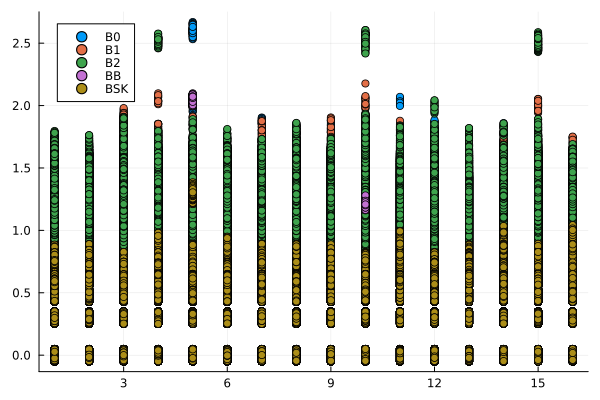
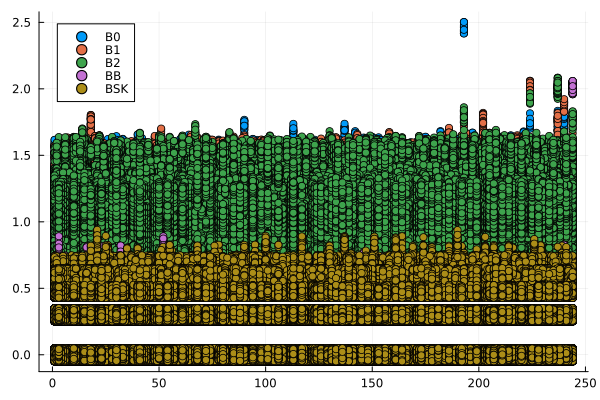
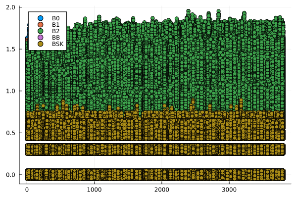
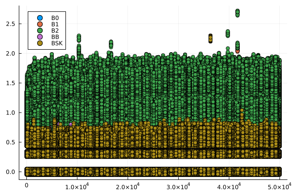
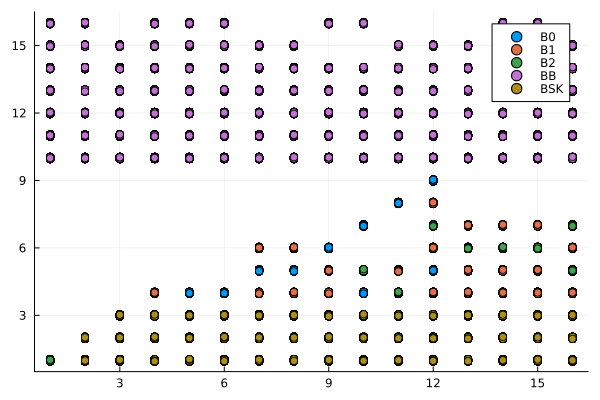
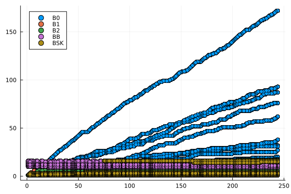
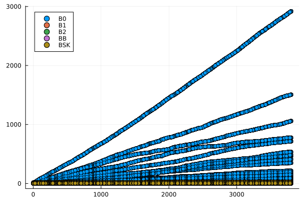
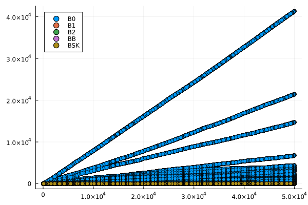

```{julia}
#| label: software

using Dates, DataFrames, JSON, MarkdownTables, Random, StatsPlots
rng = Xoshiro(20250331)
```

# Introducción

@sadit_algoritmos[capítulo 5] discute algoritmos adaptables de búsqueda en arreglos organizados. En el modelo de comparación, estos algoritmos buscan identificar la posición de inserción, $p$, en la que debe acomodarse un valor $x$ para que el arreglo $A = (a_1, \dots, a_n), \, a_1 \leq \dots \leq a_n$ se mantenga ordenado después de la inserción de $x$.

En la @sec-busqueda se presentan e implementan en `Julia` los algoritmos analizados, tanto para el caso base (la búsqueda binaria), cuyo costo depende del tamaño del arreglo, como para los algoritmos adaptables. Como se observa en dicha sección, la particularidad de estos últimos es que su costo de ejecución depende de $p$ y no del tamaño del arreglo.

A continuación, en la @sec-experimentos se implementan diversos experimentos para probar cada algoritmo en cuanto al tiempo de ejecución y el número de operaciones de comparación requeridas. Al respecto, se observa que en los experimentos realizados no se observa una tendencia clara en los datos que permita identificar si se satisface la expectativa de que el tiempo de ejecución y el número de operaciones de los algoritmos analizados dependen de $p$.

Por lo tanto, en la @sec-conclusion se concluye que se requiere mayor investigación para determinar la causa del comportamiento inesperado.

# Algoritmos de búsqueda {#sec-busqueda}

En esta sección se analizan diversos algoritmos de búsqueda descritos en @sadit_algoritmos[capítulo 5], así como una implementación propia de un algoritmo de búsqueda sobre SkipLists. Para cada uno, se explica cuál es el costo del problema y se describe una función en `Julia` para su implementación.

## Búsqueda binaria acotada {#sec-binaria}

La búsqueda binaria en el subarreglo $A[i:f]$ consiste en verificar si $x$ se encuentra antes o después del punto medio, $m = \lfloor \frac{i + f}{2} \rfloor$, para lo cual se debe comparar $x$ con $a_m$, actualizar $i$ o $f$ para continuar la búsqueda en un arreglo de la mitad del tamaño e iterar hasta llegar al caso base, en donde $i \geq f$. Cuando se llega a ese punto, entonces únicamente hay que comparar $x$ con el valor de $a_i$ correspondiente y seleccionar $p$ como $i$ o $i + 1$, dependiendo del resultado obtenido. Esta implementación  obtiene un costo de búsqueda de $O(\log_2 n)$ [@sadit_algoritmos, sección 5.1.1].

Este algoritmo fue implementado en `Julia` mediante la función `busqueda_binaria()`, en la que se adicionó un argumento opcional para contabilizar el número de veces que se calcula el punto medio, que corresponde al costo del problema.

```{julia}
#| label: funcion_busqueda_binaria

function busqueda_binaria(
    A::Vector{T}, 
    x::T, 
    c::Union{Nothing, Int64} = nothing,
    inicio::Int64 = 1, 
    final::Int64 = length(A) ) where {T}
    while inicio < final
        medio = (inicio + final) ÷ 2
        if x <= A[medio]
            final = medio
        else
            inicio = medio + 1
        end
        
        if c isa Int64
            c += 1
        end
    end
    p = x <= A[inicio] ? inicio : inicio + 1
    return p, c
end
```

```{julia}
#| label: verificar_busqueda_binaria
#| include: false

# Funciona bien :)
for x in [0, 69, 70, 71]
    println( busqueda_binaria([10, 20, 30, 40, 50, 60, 70], x) )
    println( busqueda_binaria([10, 20, 30, 40, 50, 60, 70], x, 0) )
end
```

De acuerdo con @sadit_algoritmos[sección 5.2], cuando $n \to \infty$ o la relación $\frac{p}{n} \to 0$, es más útil definir un rango que pueda contener la respuesta antes de aplicar la búsqueda binaria. Esto se puede implementar mediante una familia de algoritmos $B_k$, cuyos primeros miembros se explican e implementan en las siguientes subsecciones. También se explica un algoritmo basado en la estructura SkipLists que tiene esta misma inspiración.

Con base en esta observación, el único algoritmo de búsqueda que depende del tamaño del arreglo, $n$, que se analiza en este documento es el implementado mediante `busqueda_binaria()`. En las siguientes subsecciones, se presentan algoritmos adaptativos que dependen de $p$.

## Búsqueda secuencial $B_0$

Sea $F_0(n) = 1, 2, \dots, n, n + 1$ una secuencia de puntos en los que se harán comparaciones entre $x$ y $a_{F_0(n)}$. Es decir, este algoritmo implementa una búsqueda exhaustiva al comparar $x$ con cada valor del arreglo $A$, por lo que no requiere una búsqueda binaria y su costo de búsqueda corresponde a todas las comparaciones que se deben hacer hasta llegar a la posición de inserción $C_0(p) = p + 1$ [@sadit_algoritmos, sección 5.2.1].

Para implementar el algoritmo, se debe iniciar la búsqueda en el primer elemento de A y continuarla hasta que se encuentre el elemento de $A$ que sea mayor que $x$ o se recorra todo el arreglo, entonces la posición de inserción de $x$ será la posición de dicho elemento [@sadit_algoritmos, sección 5.1.1].

Este algoritmo se implementó en `Julia` mediante la función `busqueda_b0()`, en la que se adicionó un argumento opcional para contabilizar el número de veces que se realizan comparaciones, que corresponde al costo del problema.

```{julia}
#| label: funcion_busqueda_b0

function busqueda_b0(
    A1::Vector{T},
    x::T,
    c::Union{Nothing, Int64} = nothing,
    inicio::Int64 = 1) where {T}
    p = 1
    A = A1[inicio:end]
    n = length(A)
    while p <= n && x > A[p]
        p += 1
        if c isa Int64
            c += 1
        end
    end
    return p, c
end
```

```{julia}
#| label: verificar_busqueda_b0
#| include: false

# Funciona bien :)
# Preguntar si el costo es p - 1
for x in [0, 69, 70, 71]
    println( busqueda_b0([10, 20, 30, 40, 50, 60, 70], x) )
    println( busqueda_b0([10, 20, 30, 40, 50, 60, 70], x, 0) )
end
```

## Búsqueda secuencial $B_1$

Sea $F_1(n) = 2^1, 2^2, \dots, 2^{\log_2 \lfloor n \rfloor + 1}$ una secuencia de puntos en los que se harán comparaciones entre $x$ y $a_{F_1(n)}$, que servirán para determinar el rango en el que se realizará la búsqueda binaria $A[2^{\lfloor \log_2 p \rfloor + 1}:2^{\lfloor \log_2 (p + 1) \rfloor + 1}]$; entonces, dependiendo de la posición $p$, el número de comparaciones que se deben realizar para determinar este rango está determinado por $\lfloor \log_2 p + 1 \rfloor + 1$. Una vez determinado, el costo de la búsqueda en dicho rango está limitado por $O(\log_2 n^\prime)$ donde $n^\prime$ es el tamaño del arreglo en el que se realiza la búsqueda binaria. Por lo tanto, el costo total de la búsqueda implementada es $C_1(p) < 2 \log_2 p + O(1)$ [@sadit_algoritmos, sección 5.2.2].

Este algoritmo se implementó en `Julia` mediante la función `busqueda_b1()`, en la que se adicionó un argumento opcional para contabilizar el número de veces que se realizan comparaciones, que corresponde al costo del problema.

```{julia}
#| label: funcion_busqueda_b1

function busqueda_b1(
    A1::Vector{T}, 
    x::T,
    c::Union{Nothing, Int64} = nothing,
    inicio::Int64 = 1) where {T}
    A = A1[inicio:end]
    n = length(A)
    p = 0

    # Determinar el rango
    # Duplicar la posición de búsqueda e ir actualizando la posición de inicio
    iteracion = 1
    while iteracion + 1 <= n && A[iteracion + 1] < x
        p = iteracion
        iteracion *= 2

        if c isa Int64
            c += 1
        end
    end

    # Realizar la búsqueda dentro del rango
    p, c = busqueda_binaria(A, x, c, p + 1, min(n, iteracion + 1))
    
    return p, c
end
```

```{julia}
#| label: verificar_busqueda_b1
#| include: false

# Funciona bien :)
for x in [0, 69, 70, 71]
    println( busqueda_b1([10, 20, 30, 40, 50, 60, 70], x) )
    println( busqueda_b1([10, 20, 30, 40, 50, 60, 70], x, 0) )
end
```

## Búsqueda secuencial $B_2$

Sea $F_2(n) = 2^{2^1}, 2^{2^2}, \dots, 2^{2^{\lfloor \log_2 \lfloor \log_2 (p + 1) + 1 \rfloor + 1}}$ una secuencia de puntos en los que se harán comparaciones entre $x$ y $a_{F_2(n)}$, que servirán para determinar el rango en el que se realizará la búsqueda binaria $A[2^{2 \lfloor \log_2 \lfloor \log_2 p \rfloor + 1 \rfloor + 1}:2^{2 \lfloor \log_2 \lfloor \log_2 (p + 1) \rfloor + 1 \rfloor + 1}]$; entonces, dependiendo de la posición $p$, el número de comparaciones que se deben realizar para determinar este rango está determinado por $\lfloor \log_2 \lfloor \log_2 (p + 1) \rfloor + 1 \rfloor + 1$. Una vez determinado este rango, se puede aplicar la búsqueda $B_1$ sobre él. Por lo tanto, el costo total de la búsqueda implementada es $C_2(p) < \log_2 p + 2 \log_2 \log_2 p + O(1)$ [@sadit_algoritmos, sección 5.2.2].

Este algoritmo se implementó en `Julia` mediante la función `busqueda_b2()`, en la que se adicionó un argumento opcional para contabilizar el número de veces que se realizan comparaciones, que corresponde al costo del problema.

```{julia}
#| label: funcion_busqueda_b2

function busqueda_b2(
    A1::Vector{T}, 
    x::T,
    c::Union{Nothing, Int64} = nothing,
    inicio::Int64 = 1 ) where {T}

    A = A1[inicio:end]
    n = length(A)
    p1 = 0

    # Determinar el rango
    # Duplicar la posición de búsqueda e ir actualizando la posición de inicio
    iteracion = 1
    valor = 2^(2^iteracion)
    while valor + 1 <= n && A[valor + 1] < x
        p1 = valor
        iteracion += 1
        valor = 2^(2^iteracion)

        if c isa Int64
            c += 1
        end
    end

    # Realizar la búsqueda dentro del rango
    p, c = busqueda_b1(A[(p1 + 1):min(valor, n)], x, c)
    
    return p + p1, c
end
```

```{julia}
#| label: verificar_funcion_busqueda_b2
#| include: false

# Funciona bien :)
for x in [0, 69, 70, 71]
    println( busqueda_b2([10, 20, 30, 40, 50, 60, 70], x) )
    println( busqueda_b2([10, 20, 30, 40, 50, 60, 70], x, 0) )
end
```

## Busqueda mediante SkipLists

Como se explicó en [el post sobre algoritmos de ordenamiento](../20250304-algoritmos_ordenamiento/index.qmd), se puede implementar una "*SkipList*" en `Julia` mediante las estructuras mutables `Nodo` y `Lista_Salto`, como se muestra a continuación.

```{julia}
#| label: estructuras_skiplist
#| code-fold: show

# Nodos
mutable struct Nodo{T}
    valor::T
    sucesores::Vector{ Union{Nodo{T}, Nothing} }
end

Nodo{T}(valor::T, nivel::Int64) where {T} = Nodo{T}(
    valor, 
    Vector{ Union{Nodo{T}, Nothing} }(nothing, nivel) )
Nodo(valor::T, nivel::Int64) where {T} = Nodo{T}(valor::T, nivel::Int64)

# Listas
mutable struct Lista_Salto{T}
    nivel_maximo::Int64
    cabeceras::Vector{ Union{Nodo{T}, Nothing} }
end

Lista_Salto{T}() where {T} = Lista_Salto(
    1, 
    Vector{ Union{Nodo{T}, Nothing}}(nothing, 1) )
Lista_Salto() = Lista_Salto{Float64}()
```

En ese post se formuló una función `inserta_skiplist!()` que recibe una lista y un valor como argumentos y cuyo resultado es la misma lista modificada al incluir el valor como uno de sus nodos. La construcción del nodo tiene un componente aleatorio que determina el número de punteros que tiene hacia otros nodos que contienen valores superiores al insertado. Para permitir la reproducibilidad de los resultados obtenidos, se adicionó un argumento opcional, `rng`, que permite indicar un generador de números aleatorio mediante el cual se determina dicho tamaño del nodo; este argumento no estaba disponible en el documento señalado.

```{julia}
#| label: funcion_inserta_skiplist

function inserta_skiplist!(
    lista::Lista_Salto{T}, 
    valor::T, 
    c::Union{ Int64, Nothing } = nothing,
    rng = nothing) where {T}
    # Asignar aleatoriamente un nivel
    nivel = 1
    if rng isa Nothing
        while rand() <= 0.5
            nivel += 1
        end
    else
        while rand(rng) <= 0.5
            nivel += 1
        end
    end

    # Si la lista tiene menos niveles, adicionar los restantes
    if nivel > lista.nivel_maximo
        for k in (lista.nivel_maximo + 1):nivel
            push!(lista.cabeceras, nothing)
        end
        lista.nivel_maximo = nivel
    end

    # Nuevo nodo
    y = Nodo{T}(valor, nivel)
    
    # Actualizar los punteros desde el máximo nivel que estoy insertando
    for k in nivel:-1:1
        # Contabilizar el número de actualizaciones del puntero
        if c isa Int64
            c += 1            
        end

        x = lista.cabeceras[k]
        if x isa Nothing
            # Si el nivel k de la cabecera está vacío, entonces apunta
            # al nuevo nodo
            lista.cabeceras[k] = y
        elseif valor < x.valor
            # Si lo que se inserta es pequeño, entonces se actualiza desde
            # el principio
            lista.cabeceras[k] = y
            y.sucesores[k] = x
        else
            # Si no está vacío, buscamos hasta que el nivel de algún 
            # sucesor sea menor y quebramos los apuntadores
            z = x.sucesores[k]
            while !(z isa Nothing) && (valor > z.valor)
                x = z
                z = z.sucesores[k]
            end
            x.sucesores[k] = y
            y.sucesores[k] = z
        end
    end
    return c
end
```

```{julia}
#| label: verificar_inserta_skiplist
#| include: false

x = Lista_Salto{Int64}()
for numero in 1:5
    inserta_skiplist!(x, rand(rng, 1:5), nothing, rng)
end
x
```

Asimismo, en esa entrada del blog se señaló que para organizar un arreglo mediante una SkipList basta insertar cada elemento del arreglo en una lista nueva y, una vez generada, seguir los apuntadores en el nivel $k = 1$ desde la cabecera de la lista hasta encontrar el valor que indica el final. Este algoritmo se había implementado en `Julia` mediante la función `ordenar_skiplist()`.

```{julia}
#| label: funcion_ordenar_skiplist

function ordenar_skiplist(
    a::Vector, 
    c::Union{ Int64, Nothing } = nothing, 
    rng = nothing)
    listado = Lista_Salto{eltype(a)}()
    ordenar = Vector{eltype(a)}()
    for elemento in a
        c = inserta_skiplist!(listado, elemento, c, rng)
    end
    siguiente = listado.cabeceras[1]
    while !(siguiente isa Nothing)
        push!(ordenar, siguiente.valor)
        siguiente = siguiente.sucesores[1]
    end
    return c, ordenar, listado
end
```

```{julia}
#| label: verificar_ordenar_skiplist
#| include: false

# Parece que funciona bien para ordenar :)
println( ordenar_skiplist(rand(1:100, 10), nothing, rng) )
println( ordenar_skiplist(rand(1:100, 10), 0, rng) )
```

En adición a los elementos señalados, que ya habían sido analizados en ese post, se generó la función `busqueda_skiplist()`, que implementa un algoritmo adaptativo para buscar un valor $x$ en una SkipList. A diferencia de los algoritmos señalados en las subsecciones anteriores, este no entrega la posición en la cual se debe insertar el valor para conservar el orden del arreglo, pues ello no tiene sentido para una SkipList, sino que entrega la referencia del nodo que sería antecesor al que se construya a partir del valor que se desea insertar, de forma que los apuntadores después de insertar el nodo con este valor mantengan el ordenamiento de la lista. El procedimiento implementado se describe a continuación:

+ Se busca el valor al que apuntan las cabeceras de la lista en las posiciones $F(n) = 2^0, 2^1, \dots, 2^{\lfloor \log_2 n + 1 \rfloor}$.
+ Se identifica el nodo con el valor más grande en dicha lista, cuyo valor es inferior al valor buscado $x$. Es decir, se reduce la dimensionalidad del rango buscado al eliminar los primeros nodos más pequeños que el valor buscado.
+ Se realiza una búsqueda descendiendo de nivel, del nodo más grande en la lista que es inferior al valor buscado.

Se adicionó un parámetro opcional en esta función que contabiliza el número de comparaciones que realiza el algoritmo, que es proporcional a su costo de ejecución. Debido al primer inciso señalado, se espera que este costo sea proporcional al valor de $p$, no al tamaño completo de la SkipList.

```{julia}
#| label: funcion_busqueda_skiplist

function busqueda_skiplist(
    lista::Lista_Salto{T}, 
    valor::T, 
    c::Union{ Int64, Nothing } = nothing ) where {T}
    k = 1
    while k <= lista.nivel_maximo && lista.cabeceras[k].valor < valor
        k *= 2

        if c isa Int64
            c += 1
        end
    end
    k = min(k, lista.nivel_maximo)

    if lista.cabeceras[k].valor >= valor
        inferior = lista.cabeceras
    else
        inferior = lista.cabeceras[k]
        while k >= 1
            # Contabilizar el número de actualizaciones del puntero
            if c isa Int64
                c += 1            
            end
            
            siguiente = inferior.sucesores[k]
            if siguiente isa Nothing || siguiente.valor >= valor
                k -= 1
            else
                # Si no está vacío, buscamos hasta que el nivel de algún 
                # sucesor sea menor y quebramos los apuntadores
                inferior = siguiente
            end
        end
    end
    return inferior, c
end
```

```{julia}
#| label: verificar_busqueda_skiplist
#| include: false
# Funciona bien :)

_, _, lista = ordenar_skiplist([10, 20, 30, 40, 50, 60, 70], nothing, rng)
for x in [0, 69, 70, 71]
    println( busqueda_skiplist( lista, x ) )
    println( busqueda_skiplist( lista, x, 0) )
end
```

# Experimentos {#sec-experimentos}

Como fue señalado en la sección anterior, se espera que el costo de ejecución de `busqueda_binaria()` sea proporcional al tamaño del arreglo, mientras que el de las demás funciones debería ser proporcional a $p$. En este sentido, en esta sección se realizan experimentos con diversos valores de $p$ para verificar si se satisface esta expectativa teórica en las funciones implementadas. En la @sec-datos se describen los datos utilizados y las consultas que fueron realizadas sobre ellos. En la @sec-tiempo, se analizan los tiempos de ejecución y en la @sec-cuenta se contabiliza el número de operaciones. En ambos casos, se observa que se los resultados obtenidos no fueron los esperados.

## Datos {#sec-datos}

Se generó el mismo diccionario denominado `datos` disponible en el [el post sobre algoritmos de ordenamiento](../20250304-algoritmos_ordenamiento/index.qmd).

```{julia}
#| label: importa_datos
#| eval: false

datos = Dict()
for numero in ["016", "032", "064", "128", "256", "512"]
    datos[parse(Int64, numero)] = JSON.parsefile(
        "../20250304-algoritmos_ordenamiento/listas-posteo-con-perturbaciones-p=$(numero).json" )
end
for numero in keys(datos)
    for asunto in keys(datos[numero])
        datos[numero][asunto] = convert(Vector{Int64}, datos[numero][asunto])
    end
    datos[numero] = convert(Dict{String, Vector{Int64}}, datos[numero])
end
datos = convert(Dict{Int64, Dict{String, Vector{Int64}}}, datos)
```

Como las fucniones `busqueda_binaria()`, `busqueda_b0()`, `busqueda_b1()` y `busqueda_b2()` requieren como entrada un arreglo ordenado y la función `busqueda_skiplist()` requiere una SkipList, entonces se procesaron los arreglos desordenados originalmente disponibles en cada diccionario interior para convertirlos en uno de estos dos tipos de insumo. Para ello, cada uno de los arreglos originales se procesó mediante la función `ordenar_skiplist()` y se conservaron las respuestas del arreglo ordenado y la SkipList que se obtienen a partir de esta función; estos arreglos se registraron en un diccionario ubicado en el lugar de memoria en que estaba originalmente disponible el insumo para esta función, que también se conservó en el mismo diccionario.

```{julia}
#| label: arreglos_ordenados
#| eval: false

ordenado = Dict{Int64, Dict{String, Vector{Int64}}}()
skiplist = Dict{Int64, Dict{String, Lista_Salto{Int64}}}()
for numero in keys(datos)
    ordenado[numero] = Dict{String, Vector{Int64}}()
    skiplist[numero] = Dict{String, Lista_Salto{Int64}}()
    for asunto in keys(datos[numero])
        _, x, y = ordenar_skiplist( datos[numero][asunto] )
        ordenado[numero][asunto] = x
        skiplist[numero][asunto] = y
    end
end
```

Asimismo, se obtuvieron números para consultar en los diferentes arreglos a partir de 4 archivos electrónicos en formato JSON, [disponibles aquí](https://www.dropbox.com/scl/fo/8zrqyv1603qfxj2a3w29b/ALkCU_d2_-Ui5zVZ5BBd1DE?rlkey=mwkqer63q8uyzivplmg4ygwuh&st=wr2ej92s&dl=0).^[Datos originalmente disponibles [@sadit_algoritmos](https://github.com/sadit/ALGO-IR/). Revise la licencia en dicha página y consulte el [aviso legal](../../legal.qmd).] Estos se registraron en un diccionario denominado `consultas`, cuyas claves son asociadas al archivo electrónico correspondiente y cuyos valores son los arreglos con los números de consulta que se realizarán.

```{julia}
#| label: consultas
#| eval: false

consultas = Dict()
for numero in [1, 2, 3, 4]
    consultas[numero] = JSON.parsefile("consultas-$(numero)-listas-posteo.json")
end
for numero in keys(consultas)
    consultas[numero] = convert(Vector{Int64}, consultas[numero])
end
consultas = convert(Dict{Int64, Vector{Int64}}, consultas)
```

## Tiempo de ejecución {#sec-tiempo}

Se observó que cada una de las claves en `ordenado` contienen vectores con la misma información. Por lo tanto, únicamente se realizarán consultas sobre los vectores disponibles en `ordenado[16]` y `skiplist[16]`, en lugar de hacerlo para cada clave en dichos diccionarios. Para cada una de las consultas disponibles en los elementos de `consultas`, se iteró 100 veces sobre los arreglos señalados y se midió el tiempo total de ejecución de las funciones disponibles en la @sec-busqueda. Cada una de las observaciones se registró en un `DataFrame` denominado `labbusc`, que contiene los siguientes campos:

+ `funcion`, que contiene una abreviatura asociada a la función de búsqueda utilizada.
+ `num_consulta`, que corresponde al número del archivo de consulta utilizado.
+ `consulta`, que corresponde al valor buscado en los vectores de `ordenado[16]` y `skiplist[16]`.
+ `tiempo`, que corresponde al tiempo total utilizado para realizar las 100 iteraciones de la consulta

```{julia}
#| label: labbusc_tiempo
#| eval: false

experimentos = [
    ("busqueda_binaria", "BB"), 
    ("busqueda_b0", "B0"), 
    ("busqueda_b1", "B1"),
    ("busqueda_b2", "B2"), 
    ("busqueda_skiplist", "BSK")]

labbusc_tiempo = DataFrame(
    funcion = Vector{String}(), 
    num_consulta = Vector{Int64}(), 
    consulta = Vector{Int64}(), 
    tiempo = Vector{Float64}()
    )
n_iter = 100

# Vamos a guardar el número de la consulta, el experimento y cuánto se demora realizándola, 
# independientemente de la lista de posteo (ya da igual porque están organizados)
for num_consulta in 1:4
    for consulta in consultas[num_consulta]
        for experimento in experimentos
            # Midamos el tiempo que se demora cada función en buscar cada 
            # consulta en todos los vectores de las listas de posteo
            f = Symbol(experimento[1])
            f = getfield(Main, f)
            x = now()
            for asunto in keys(ordenado[16])
                for i in 1:n_iter
                    if experimento[1] != "busqueda_skiplist"
                            f(ordenado[16][asunto], consulta)
                    else
                            f(skiplist[16][asunto], consulta)
                    end
                end
                push!(labbusc_tiempo, 
                      (experimento[2], num_consulta, consulta, 
                       Dates.value( Millisecond(now() - x) ) ) )
            end
        end
    end
end
```

Con base en esta información se generaron gráficos de dispersión, para cada archivo de consultas, que muestran el logaritmo en base 10 del tiempo que toma cada función para ejecutar las consultas en los vectores ordenados como función del valor consultado $p$. Estas se muestran en la @fig-labbusc_tiempo.

```{julia}
#| label: grafico-busquedas_tiempo
#| eval: false

jitter(n::Real, factor = 0.1) = n + (0.5 - rand()) * factor

labbusc_tiempo = filter(row -> !isnan(row.tiempo) && row.tiempo > 0, labbusc_tiempo)
for i in 1:4
    grafico = filter(row -> row.num_consulta == i, labbusc_tiempo)
    plot = @df grafico scatter(:consulta, jitter.(log10.(:tiempo)), group = :funcion) 
    savefig(plot, "busquedas_$(i)_tiempo.png")
end
```

::: {#fig-labbusc_tiempo layout-ncol=2}





Tiempos de ejecución
:::

## Contabilización del número de comparaciones {#sec-cuenta}

Homólogamente, se contabilizó el número de comparaciones que requirió cada algoritmo para realizar la búsqueda de cada valor. A diferencia del caso anterior, este experimento se realizó una única vez por experimento, pues el número de comparaciones es determinístico.

```{julia}
#| label: labbusc_cuenta
#| eval: false

labbusc_cuenta = DataFrame(
    funcion = Vector{String}(), 
    num_consulta = Vector{Int64}(), 
    consulta = Vector{Int64}(), 
    contabilidad = Vector{Float64}()
    )

# Vamos a guardar el número de la consulta, el experimento y cuántas comparaciones hace, 
# independientemente de la lista de posteo (ya da igual porque están organizados)
for num_consulta in 1:4
    for consulta in consultas[num_consulta]
        for experimento in experimentos
            # Midamos el tiempo que se demora cada función en buscar cada 
            # consulta en todos los vectores de las listas de posteo
            f = Symbol(experimento[1])
            f = getfield(Main, f)
            x = now()
            for asunto in keys(ordenado[16])
                if experimento[1] != "busqueda_skiplist"
                    _, c = f(ordenado[16][asunto], consulta, 0)
                else
                    _, c = f(skiplist[16][asunto], consulta, 0)
                end
                push!(labbusc_cuenta, 
                      (experimento[2], num_consulta, consulta, c) )
            end
        end
    end
end
```

Con base en esta información se generaron gráficos de dispersión, para cada archivo de consultas, el número de comparaciones que requiere cada función para ejecutar las consultas en los vectores ordenados, como función del valor consultado $p$. Estas se muestran en la @fig-labbusc_cuenta.

```{julia}
#| label: grafico-busquedas_cuenta
#| eval: false

labbusc_cuenta = filter(row -> !isnan(row.contabilidad) && row.contabilidad > 0, labbusc_cuenta)
for i in 1:4
    grafico = filter(row -> row.num_consulta == i, labbusc_cuenta)
    plot = @df grafico scatter(:consulta, jitter.(:contabilidad), group = :funcion) 
    savefig(plot, "busquedas_$(i)_cuenta.png")
end
```

::: {#fig-labbusc_cuenta layout-ncol=2}





Cantidad de operaciones
:::

# Conclusión {#sec-conclusion}

Se esperaba que los algoritmos implementados tuvieran un desempeño proporcional al logaritmo del valor buscado, por lo que tenían un desempeño óptimo. Sin embargo, los resultados obtenidos arrojaron un desempeño con una tendencia no discernible con respecto al valor buscado, situación que es diferente a la esperada. Es necesario una mayor profundización en el estudio de los algoritmos para determinar la causa de este comportamiento.

# Referencia